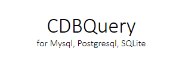

**CDBQuery 是用c++编写的跨平台数据库操作框架，目前支持MySQL，Postgresql，SQLite三种数据库**

# Features
* 使用IO多路复用技术，支持select、poll及epoll
* 基于异步事件，支持信号事件、超时事件及读写事件
* 使用线程池来支持多线程
* 使用c++11及c++14新特性，基本上全部使用智能指针进行资源管理
* 支持http协议1.0/1.1，支持长短连接，并能优雅关闭连接
* 仅支持Linux
* 使用连接池来复用连接以提高效率
* 增加异步日志系统，利用空闲缓冲池队列来进行异步日志系统性能优化

**WARNING: There's bugs in this project**
> When benched with webbench.c for high concurrency for more than 60 seconds, the code may corupt.

# Building
```
make
```

# Test
测试前需要修改 test/main.cpp 中的数据库账号密码
```
cd test  
make  
./CDBTest
```

# Usage
使用libevent-cpp能够非常方便的创建一个http服务器，比如如下例子创建一个简单的静态http文件服务器
```c++
#include <iostream>

#include <stdio.h>
#include <string>
#include "CDBQuery.h"
#include "CDBPool.h"
#include "CSecurity_audit.h"

using namespace std;

#define MYSQL_DBHOST "127.0.0.1"
#define MYSQL_DBUSER "root"
#define MYSQL_DBPSWD "4701641"
#define MYSQL_DBNAME "act"
#define MYSQL_DBPORT 3306

// sql 预处理操作 API 示例
int prepareInsert()
{
    // 设置并创建 名为 "act" 的数据库连接
    CDBPool pool(0,
                      MYSQL_DBHOST,
                      MYSQL_DBUSER,
                      MYSQL_DBPSWD,
                      MYSQL_DBNAME,
                      MYSQL_DBPORT);

    int ret = pool.create("act");
    if(ret < 0) {
        return -1;
    }
    CDBQuery query("act");

    // mysql 预处理方式操作 插入数据，返回 自增 id， 删，改 方式一样
    const char* insertsql = "insert into security_audit(securitycheck_id, "
                                               "audit_type, "
                                               "audit_id, "
                                               "audit_uname, "
                                               "audit_nickname, "
                                               "audit_time, "
                                               "audit_result, "
                                               "audit_explains) values(?, ?, ?, ?, ?, ?, ?, ?);";

//    int    id        = 2;
    int    securitycheck_id    = 1;
    int    audit_type          = 3;
    int    audit_id            = 22;
    string audit_uname         = "check";
    string audit_nickname      = "闸机售票";
    string audit_time          = "2019-08-27 15:31:11";
    int    audit_result        = 1;
    string audit_explains      = "hahaha";

    ret = query.prepare(insertsql);
    if(ret != 0) {
        return -1;
    }
    cout<<"ret: "<<ret<<endl;
    ret = query.addBindValue(0, securitycheck_id);
    ret = query.addBindValue(1, audit_type);
    ret = query.addBindValue(2, audit_id);
    ret = query.addBindValue(3, audit_uname);
    ret = query.addBindValue(4, audit_nickname);
    ret = query.addBindValue(5, audit_time);
    ret = query.addBindValue(6, audit_result);
    ret = query.addBindValue(7, audit_explains);

    // ret < 0 表示执行失败
    cout<<"ret: "<<ret<<endl;
    ret = query.exec();// 返回 插入自增 id 值，或者 update/delete 受影响数据量
    if(ret < 0) {
        cout<<"error reason: "<<query.getLastErrorMsg()<<endl;
        return ret;
    }
    cout<<"prepareInsert ret: "<<ret<<"\n";
    return 0;
}

// sql 预处理操作 API 示例
int prepareSelect()
{
    CDBQuery query("mysql");
    CSecurity_audit audit;

    // mysql 预处理方式操作 查找数据
    const char* selectsql = "select * from security_audit where audit_type = ? and audit_id = ? limit 10;";
//    query.startPageQuery(); // 开启分页查询，查询一次后，分页查询设置失效，第二次分页查询需要重新设置
//    query.stopPageQuery();// 关闭分页查询
    int ret = query.prepare(selectsql);
    if(ret != 0) {
        return -1;
    }
    ret = query.addBindValues(3, 22);
    ret = query.query();
    if(ret < 0) {
        cout<<"error reason: "<<query.getLastErrorMsg()<<endl;
        return ret;
    }
    int count = query.pagingCount();// 分页查询时，返回查询到的总页数
    cout<<"count: "<<count<<endl;
    while (query.next()) {
        // 第一种赋值方式 (ret < 0 表示失败)
        ret = query.getValue("id",                audit.id);
        ret = query.getValue("securitycheck_id",  audit.securitycheck_id);
        ret = query.getValue("audit_type",        audit.audit_type);
        ret = query.getValue("audit_id",          audit.audit_id);
        ret = query.getValue("audit_uname",       audit.audit_uname);
        ret = query.getValue("audit_nickname",    audit.audit_nickname);
        ret = query.getValue("audit_time",        audit.audit_time);
        ret = query.getValue("audit_result",      audit.audit_result);
        ret = query.getValue("audit_explains",    audit.audit_explains);
//        cout<<audit;
    }

    cout<<"prepareSelect set: "<<ret<<"\n";
    return 0;
}

// sql 直接执行操作 API 示例
int sqlInsert()
{
    // 从默认数据库连接中取连接句柄（本程序中，第一次创建的数据库连接）
    CDBQuery query;

    // mysql 直接方式操作  插入数据，删，改 方式一样
    const char* insertsql2 = "insert into security_audit(securitycheck_id, "
                                               "audit_type, "
                                               "audit_id, "
                                               "audit_uname, "
                                               "audit_nickname, "
                                               "audit_time, "
                                               "audit_result, "
                                               "audit_explains) "
                             "values(1, 3, 15, 'check', '闸机售票', "
                             "'2019-08-28 16:11:11', 2, 'aaaaaaaaa');";
    // ret < 0 表示执行失败
    int ret = query.exec(insertsql2);// 返回 insert 插入自增 id 值，或者 update/delete 受影响数据条数
    if(ret < 0) {
        cout<<"error reason: "<<query.getLastErrorMsg()<<endl;
        return ret;
    }
    cout<<"sqlInsert success ret: "<<ret<<"\n";
    return 0;
}

// sql 直接执行操作 API 示例
int sqlDelete()
{
    // 设置并创建 名为 "mysql_act" 的数据库连接
    CDBPool pool(0,
                      MYSQL_DBHOST,
                      MYSQL_DBUSER,
                      MYSQL_DBPSWD,
                      MYSQL_DBNAME,
                      MYSQL_DBPORT);

    int ret = pool.create("mysql_act");
    if(ret < 0) {
        return -1;
    }

    // 从名为 "mysql"数据库连接中取连接句柄，如果在取连接前未进行数据库连接设置和创建，则报错
    CDBQuery query("mysql");

    // mysql 直接方式操作  插入数据，删，改 方式一样
    const char* deletesql = "delete from security_audit where id < 500;";
    // ret < 0 表示执行失败
    ret = query.exec(deletesql);// 返回 insert 插入自增 id 值，或者 update/delete 受影响数据条数
    if(ret < 0) {
        cout<<"error reason: "<<query.getLastErrorMsg()<<endl;
        return ret;
    }
    cout<<"sqlDelete success ret: "<<ret<<"\n";
    return 0;
}

// sql 直接执行操作 API 示例
int sqlUpdate()
{
    // 从名为 "act"数据库连接中取连接句柄，如果在取连接前未进行数据库连接设置和创建，则报错
    CDBQuery query("act");

    // mysql 直接方式操作  插入数据，删，改 方式一样
    const char* updatesql = "update security_audit set audit_type = 5, "
                            "audit_uname='qian' where id < 1100;";
    // ret < 0 表示执行失败
    int ret = query.exec(updatesql);// 返回 insert 插入自增 id 值，或者 update/delete 受影响数据条数
    if(ret < 0) {
        cout<<"error reason: "<<query.getLastErrorMsg()<<endl;
        return ret;
    }
    cout<<"sqlUpdate success ret: "<<ret<<"\n";
    return 0;
}

// sql 直接执行操作 API 示例
int sqlSelect()
{
    // 从名为 "mysql"数据库连接中取连接句柄
    CDBQuery query("mysql");
    CSecurity_audit audit;

    // mysql 直接方式操作  查找数据
    const char* selectsql2 = "select * from security_audit where audit_type = 3 and audit_id = 22 limit 10;";
//    query.startPageQuery(); // 开启分页查询，查询一次后，分页查询设置失效，第二次分页查询需要重新设置
//    query.stopPageQuery();// 关闭分页查询
    int ret = query.query(selectsql2);
    // ret < 0 sql 操作失败
    if(ret < 0) {
        cout<<"error reason: "<<"  "<<query.getLastErrorMsg()<<endl;
        return ret;
    }
    int count = query.pagingCount();// 分页查询时，返回查询到的总页数
    cout<<"count: "<<count<<endl;
    while (query.next()) {
        // 第一种赋值方式 (ret < 0 表示失败)
        query.getValue("id",                audit.id);
        query.getValue("securitycheck_id",  audit.securitycheck_id);
        query.getValue("audit_type",        audit.audit_type);
        query.getValue("audit_id",          audit.audit_id);
        query.getValue("audit_uname",       audit.audit_uname);
        query.getValue("audit_nickname",    audit.audit_nickname);
        query.getValue("audit_time",        audit.audit_time);
        query.getValue("audit_result",      audit.audit_result);
        query.getValue("audit_explains",    audit.audit_explains);
        cout<<audit;
//        audit.clear();

        // 第二种赋值方式 (ret < 0 表示失败)
        query.getValue(0, audit.id);
        query.getValue(1, audit.securitycheck_id);
        query.getValue(2, audit.audit_type);
        query.getValue(3, audit.audit_id);
        query.getValue(4, audit.audit_uname);
        query.getValue(5, audit.audit_nickname);
        query.getValue(6, audit.audit_time);
        query.getValue(7, audit.audit_result);
        query.getValue(8, audit.audit_explains);
//        cout<<audit;
//        audit.clear();

        // 第三种赋值方式
        audit.id               = query.value("id").toInt();
        audit.securitycheck_id = query.value("securitycheck_id").toInt();
        audit.audit_type       = query.value("audit_type").toInt();
        audit.audit_id         = query.value("audit_id").toInt();
        audit.audit_uname      = query.value("audit_uname").toString();
        audit.audit_nickname   = query.value("audit_nickname").toString();
        audit.audit_time       = query.value("audit_time").toString();
        audit.audit_result     = query.value("audit_result").toInt();
        audit.audit_explains   = query.value("audit_explains").toString();
//        cout<<audit;
//        audit.clear();

        // 第四种赋值方式（通过 set 赋值）
        audit.id               = query.getValue("id");
        audit.securitycheck_id = query.getValue("securitycheck_id");
        audit.audit_type       = query.getValue("audit_type");
        audit.audit_id         = query.getValue("audit_id");
        audit.audit_uname      = string(query.getValue("audit_uname"));
        audit.audit_nickname   = string(query.getValue("audit_nickname"));
        audit.audit_time       = string(query.getValue("audit_time"));
        audit.audit_result     = query.getValue("audit_result");
        audit.audit_explains   = string(query.getValue("audit_explains"));

        audit.setId               (query.getValue("id"));
        audit.setSecuritycheck_id (query.getValue("securitycheck_id"));
        audit.setAudit_type       (query.getValue("audit_type"));
        audit.setAudit_id         (query.getValue("audit_id"));
        audit.setAudit_uname      (query.getValue("audit_uname"));
        audit.setAudit_nickname   (query.getValue("audit_nickname"));
        audit.setAudit_time       (query.getValue("audit_time"));
        audit.setAudit_result     (query.getValue("audit_result"));
        audit.setAudit_explains   (query.getValue("audit_explains"));
//        cout<<audit;
//        audit.clear();

        // 第五种赋值方式（通过 set 赋值）
        audit.setId               (query.getValue(0));
        audit.setSecuritycheck_id (query.getValue(1));
        audit.setAudit_type       (query.getValue(2));
        audit.setAudit_id         (query.getValue(3));
        audit.setAudit_uname      (query.getValue(4));
        audit.setAudit_nickname   (query.getValue(5));
        audit.setAudit_time       (query.getValue(6));
        audit.setAudit_result     (query.getValue(7));
        audit.setAudit_explains   (query.getValue(8));
        cout<<audit;
    }

    cout<<"sqlSelect success ret: "<<ret<<"\n";
    return 0;
}

// 事物操作调用
int transaction()
{
    // 从名为 "mysql"数据库连接中取连接句柄
    CDBQuery query("mysql");
    // 事物操作
    int ret = query.begin();  // 开启事物操作
    bool isSuccess = true;

    // 所有事物操作逻辑

    if(isSuccess) {
        ret = query.commit();  // 事物提交
        cout<<"transaction success ret: "<<ret<<"\n";
    } else {
        ret = query.rollback();  // 事物回滚
    }
    return 0;
}

int main() {
    // 入口处设置数据库连接的帐号/密码/连接数据库类型（mysql/postgresql/sqlite）
    // 必须在数据库使用前设置帐号密码
    CDBPool pool(0,
                      MYSQL_DBHOST,
                      MYSQL_DBUSER,
                      MYSQL_DBPSWD,
                      MYSQL_DBNAME,
                      MYSQL_DBPORT);
    // 设置此数据库连接名为 "mysql"
    int ret = pool.create("mysql");
    // 判断数据库连接帐号是否设置正确
    if(ret < 0) {
        return -1;
    }
    prepareInsert();
    prepareSelect();
    sqlInsert();
    sqlDelete();
    sqlUpdate();
    sqlSelect();
    transaction();
    return 0;
}
```
